[](https://github.com/hkaanturgut/zero-to-production-mcp/actions/workflows/release.yml)

# Zero to Production MCP: turn any API into an agent tool

Workshop companion for **"From Zero to Production MCP Server"**, MCP Dev Summit Toronto, 5 Oct 2026.
A fictional Toronto used-car dealer is the showcase; the patterns are the point. All data is synthetic.


| Build | Secure | Ship |
| --- | --- | --- |
| An MCP server in front of an internal REST API, one stage at a time | Entra sign-in, a permission per tool, human confirmation, secrets the model never sees | Container Apps in a private network behind API Management, CI/CD with GitHub Actions |

**Contents:** [Follow the workshop](#follow-the-workshop) · [Workshop materials](#workshop-materials) · [Why MCP](#why-mcp) · [How MCP talks](#how-mcp-talks) ·
[One request, end to end](#one-request-end-to-end) · [The build](#the-build-six-stages) ·
[Who can do what](#who-can-do-what) · [Every call passes these gates](#every-call-passes-these-gates) ·
[Wrong tool](#when-the-model-picks-the-wrong-tool) · [Human confirmation](#human-confirmation) · [When the backend fails](#when-the-backend-fails) ·
[Ship it](#ship-it) · [See every call](#see-every-call) · [From one server to hundreds](#from-one-server-to-hundreds) ·
[Run it](#run-it) · [Deep dive](#deep-dive)

---

## Follow the workshop

Everything in the session runs on your laptop: a mock dealer system, the MCP server you build, local
test tokens and MCP Inspector. **No Azure account needed.** The Azure part at the end runs on the
presenter's environment; deploy your own later with [`workshop/deploy-azure.ipynb`](workshop/deploy-azure.ipynb) ([Deploy to Azure](#deploy-to-azure)).

**Before the session** (downloads are slow on shared conference Wi-Fi): install git, Python 3.11+,
[uv](https://docs.astral.sh/uv/) and Node.js (for MCP Inspector), then run:

```bash
git clone https://github.com/hkaanturgut/zero-to-production-mcp.git
cd zero-to-production-mcp
./scripts/demo.sh setup                                  # installs dependencies, creates .env and local keys
npx -y @modelcontextprotocol/inspector@latest --help     # caches MCP Inspector
```

On Windows, use WSL or Git Bash for the scripts.

**During the session**, open three terminals in the repo:

| Terminal | Command | What it runs |
| --- | --- | --- |
| 1 | `./scripts/demo.sh dms` | The mock dealer system on `:8081` |
| 2 | `./scripts/demo.sh live` | The MCP server you build (`src/live/server.py`) on `:8080`, reloads on save |
| 3 | `./scripts/demo.sh inspector salesperson` | MCP Inspector with a local token (`manager`, `agent`, `readonly` also work) |

Each stage is a branch with the finished file. Fell behind? Check out the stage you want and keep going:

| Stage | Branch | Adds | Production lesson |
| --- | --- | --- | --- |
| 0 | `stage-0` | Empty file; the internal API | The MCP server is a thin layer you own, in front of the API |
| 1 | `stage-1` | `search_inventory`, `get_vehicle` | The naive version leaks data and trusts its input |
| 2 | `stage-2` | Typed inputs, output schemas, `quote_price`, `/healthz` | Schemas are the contract; business math lives in code |
| 3 | `stage-3` | Entra token validation, caller identity, `create_lead`, `get_lead`, masking | Identity comes from the token; personal data is masked before the model sees it |
| 4 | `stage-4` | Permission per tool, `apply_discount` policy, human confirmation, `delete_lead` | Least privilege; costly actions need a human |
| 5 | `stage-5` | Per-attempt timeouts, read-only retries, audit log, rate limit | Fail fast, retry reads only, trace every call |

`git checkout stage-3` shows the end of stage 3. The `main` branch has the finished server (stage 5)
plus everything in this README.

**Prefer clicking to terminals?** Open [`workshop/demo.ipynb`](workshop/demo.ipynb) in VS Code (Python and Jupyter
extensions) and run its cells in order instead of the three terminals. It runs everything locally and ends by
connecting Copilot to the server you built; [`workshop/azure.ipynb`](workshop/azure.ipynb) continues with the
deployed version.

**Try it with GitHub Copilot:** in VS Code, *MCP: List Servers > dealer-local > Start*, paste a token from
`./scripts/demo.sh token salesperson`, and ask Copilot (Agent mode) to find an SUV, quote it and apply a
$900 discount.

### Workshop materials

| File | For | What it is |
| --- | --- | --- |
| [`workshop/demo.ipynb`](workshop/demo.ipynb) | Everyone | Build and run it locally: starts the servers, switches stages, makes every call, then connects Copilot to your server. No terminal, no Azure |
| [`workshop/azure.ipynb`](workshop/azure.ipynb) | Anyone with access to a deployment | The deployed version: the lock-down behind API Management, a real Entra call, Copilot on `dealer-cloud`. Read-only by default |
| [`workshop/deploy-azure.ipynb`](workshop/deploy-azure.ipynb) | Anyone with an Azure subscription | Guided deploy of your own copy: sign in, choose subscription, name and region, deploy, test, delete |
| [`docs/DEEP-DIVE.md`](docs/DEEP-DIVE.md) | Readers | Every practice with where it lives in the code and its official source; enterprise Q&A |
| [`docs/RUNBOOK.md`](docs/RUNBOOK.md) | Presenter | The 60-minute plan (slides and notebooks), setup, cut order, and every stage in terminal form with recovery steps |
| [`docs/MCP-DevSummit-Toronto-Kaan-Turgut.pptx`](docs/MCP-DevSummit-Toronto-Kaan-Turgut.pptx) | Everyone | The session's slides (the theory), with speaker notes and timings |
| [`docs/SHOW-PREP.md`](docs/SHOW-PREP.md) | Presenter | Slides outline, fallback plan, video scripts, show-morning checklist |
| `scripts/preshow.sh` | Presenter | One command that checks both environments, resets demo data and makes a real-token call |
| `workshop/rehearse.py` | Presenter | Runs all 34 runbook steps and reports PASS/FAIL (`./scripts/demo.sh rehearse`) |
| [`docs/HLD.md`](docs/HLD.md), [`docs/CHECKLIST.md`](docs/CHECKLIST.md) | Architects | Design notes and the production checklist |

---

## Why MCP

**MCP doesn't replace your REST API. It sits in front of it.** A REST API is built for a developer who
reads the docs and decides what to call. An agent decides at runtime, can be tricked by the data it reads,
and every AI app (VS Code, Claude, a Foundry agent) would otherwise need its own integration, sign-in and
rules for every API. An MCP server gives all of them one standard way to discover and call your tools, and
one place to enforce who may do what.

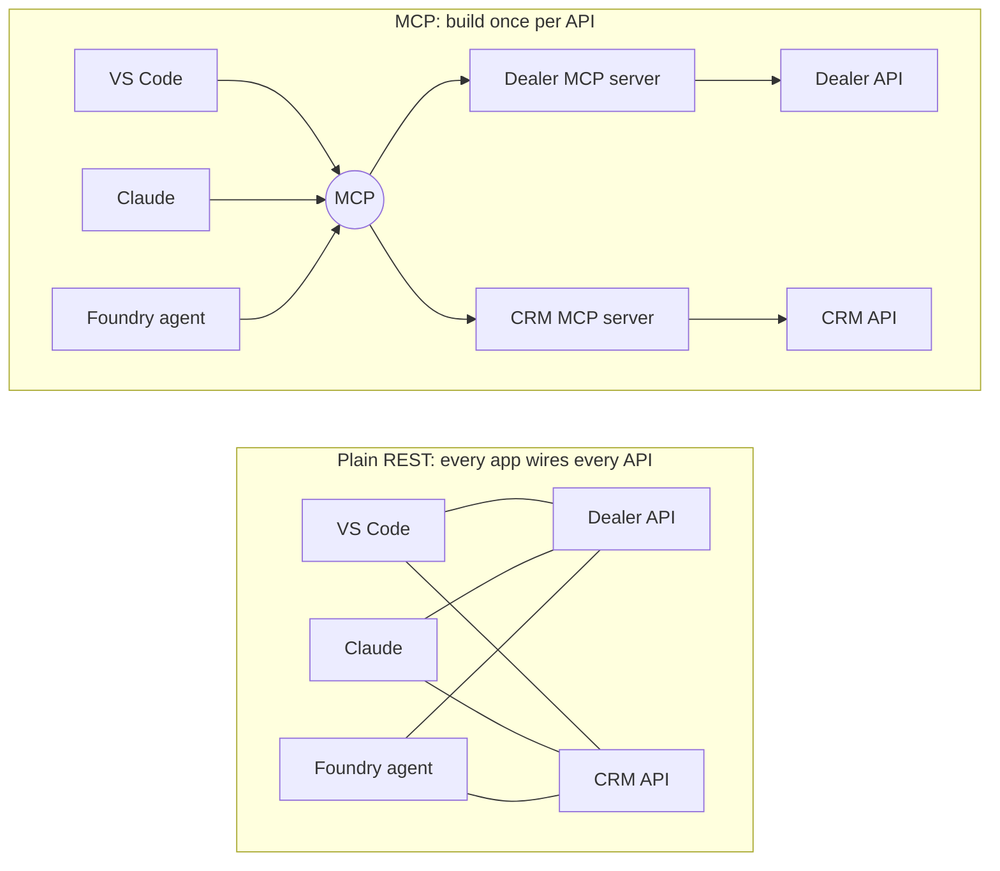

| | Agent calls the REST API | Agent calls the MCP server |
| --- | --- | --- |
| Discovery | Docs pasted into each app | `tools/list` with schemas, at runtime |
| Data | Every field (VIN, prices before fees) | Only what the model needs, fees included |
| Identity | One shared API key | The person or agent in the Entra token |
| Rules | In the prompt | In code: holds against prompt injection |
| Risky actions | Just called | A human confirms first |

With N apps and M APIs, direct integration means N × M custom connections; with MCP each app speaks MCP
once and each API gets one server, N + M. One app of yours calling one API? Plain function calling is
fine. MCP pays off when several AI apps or agents share a system, callers have different permissions, or
you must prove who did what.

## How MCP talks

MCP uses **[JSON-RPC 2.0](https://www.jsonrpc.org/specification)**: a request names a `method` and `params`
with an `id`; the reply returns that `id` with a `result` or an `error`. Over HTTP, each call is a `POST /mcp`.

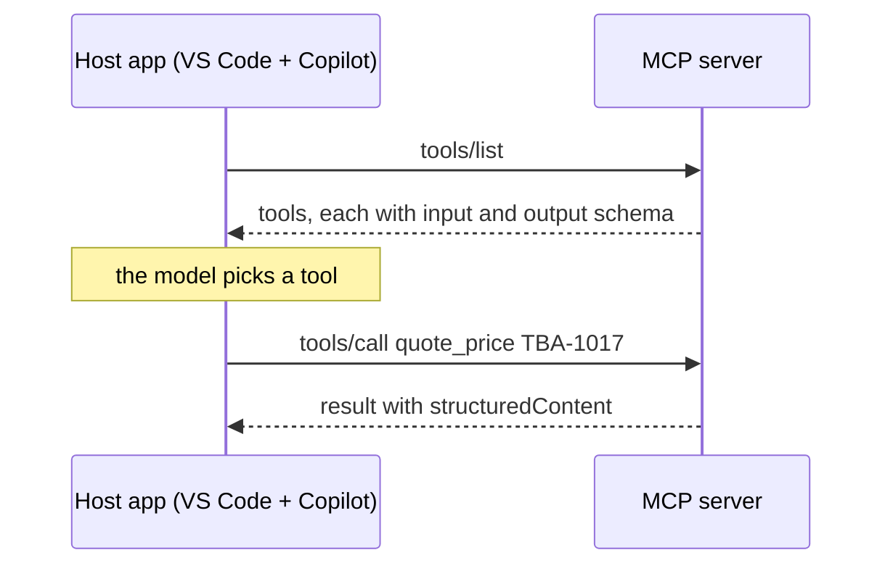

```json
{"jsonrpc": "2.0", "id": 7, "method": "tools/call",
 "params": {"name": "quote_price", "arguments": {"stock_number": "TBA-1017"}}}
```

A refusal (say, a discount over the limit) is a normal `result` with `"isError": true` the model can read;
a broken request gets a JSON-RPC `error`. **Spec 2026-07-28:** stateless (no `initialize`), multi
round-trip for human input, CIMD instead of dynamic client registration, Roots/Sampling/Logging deprecated.

## One request, end to end

The whole security story in one picture: every request is rate-limited, authenticated, permission-checked
and audited, and the server reaches the backend with its own credential, never the user's token.

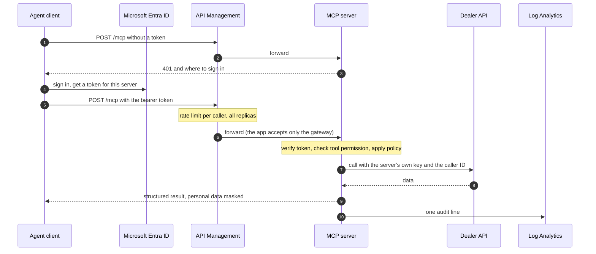

The dealer API key comes from Key Vault over a private endpoint; the user's token never goes downstream.

## The build: six stages

Each stage fixes what the previous one got wrong. The stage 1 server works in 20 lines but is unsafe;
stages 2 to 5 turn it into something you can run in production.

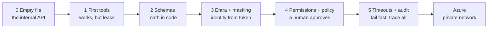

Each stage is a branch (`stage-0` to `stage-5`) with the finished file.

## Who can do what

People and agents sign in differently: people carry delegated scopes, agents carry app roles. The server
merges both into one permission set, so each tool checks one thing whoever calls it, and manager rights are
a role nobody can grant themselves.

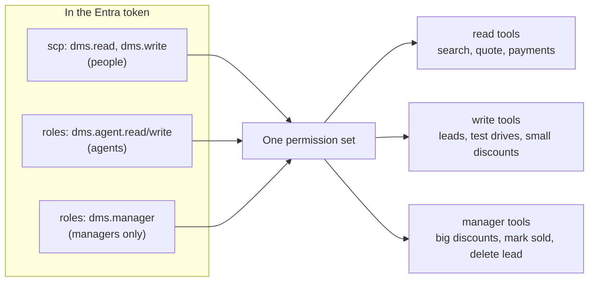

| Persona | Sees |
| --- | --- |
| `readonly` | 5 read tools |
| `salesperson` | 9 tools, discounts up to $500 |
| `agent` (Foundry, app-only) | 9 tools, never manager |
| `manager` | 11 tools, bigger discounts after confirmation |

Tools a caller can't use are hidden from `tools/list`. Full tool list: [deep dive §3](docs/DEEP-DIVE.md#3-the-tools).

## Every call passes these gates

Assume every call could be wrong, malicious or steered by a prompt injection. Each gate stops a different
failure, cheap checks first, and only a call that passes all of them reaches your system.

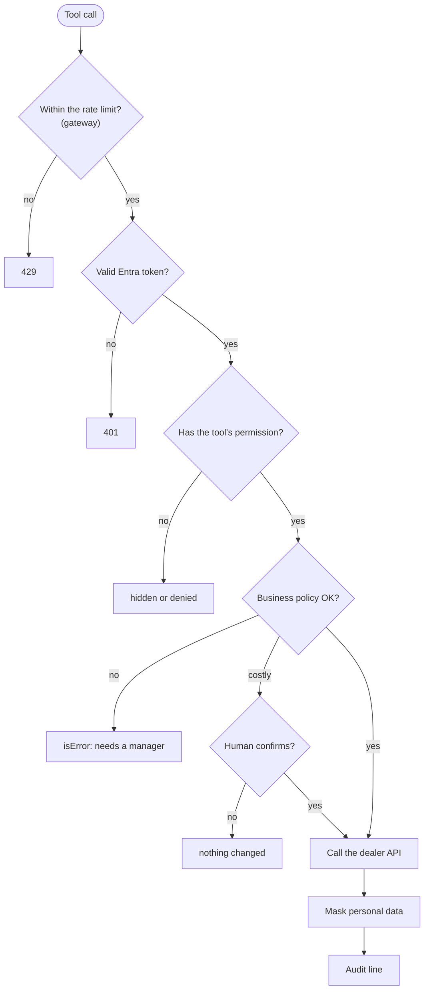

| Gate | Where |
| --- | --- |
| Rate limit per caller | API Management policy (`infra/modules/apim-api.bicep`) + `RateLimitingMiddleware` |
| Token check (`scp` + `roles` merged) | `EntraVerifier` in `src/live/server.py`, `src/server/auth.py` |
| Permission per tool | `AuthMiddleware` + `restrict_tag` |
| Policy: 15% cap, $500 limit | `apply_discount`, `src/server/domain/policy.py` |
| Masking | `src/server/domain/masking.py` |

Every control, with tests and official sources: [deep dive §4](docs/DEEP-DIVE.md#4-security).

## When the model picks the wrong tool

It will, sometimes: a different model, a vague request or an injected instruction is enough. Two jobs:
make a wrong call **harmless**, and **measure** how often it happens so you can fix the tool design.

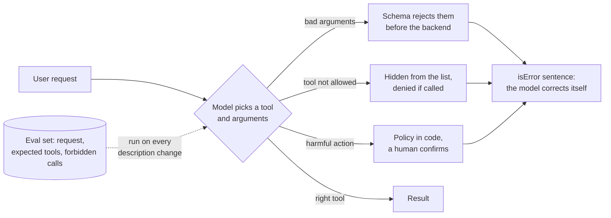

| Practice | How |
| --- | --- |
| Design for selection | Few tools, verb-first names, one job each, descriptions that say when **not** to use them. The description is the prompt. |
| Make wrong calls cheap | Schemas, permissions, policy in code, human confirmation, `isError` messages (this repo) |
| Measure with evals | A small set of requests with the expected tool calls, run against the models your users use, on every change to tool names or descriptions |
| Watch production | The audit line records tool and outcome; repeated `isError` or `denied` on a tool usually means its description misleads the model |

An eval case is just data:

```json
{"request": "How much is the 2021 Tiguan, all in?",
 "expect_tools": ["search_inventory", "quote_price"], "forbid": ["apply_discount"]}
```

This repo covers the first, second and fourth rows; an eval set is the next step.

## Human confirmation

Some actions cost money or can't be undone. The server pauses and asks the person through their app; the
request state is sealed, so the arguments can't change between the question and the answer.

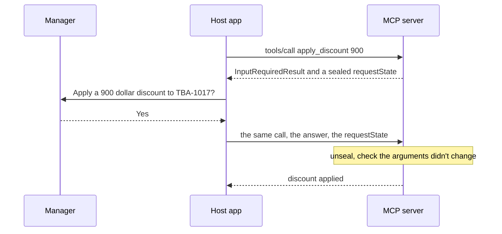

Spec 2026-07-28 "multi round-trip". Older clients get the same rule through classic elicitation.

## When the backend fails

Your backend will be slow or down sometimes. The server answers fast and honestly instead of hanging,
retries only what is safe to repeat, and stops hammering a backend that is clearly failing.

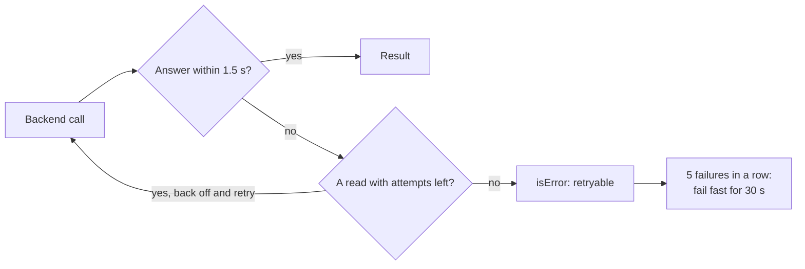

Writes are never retried by the server; they carry an idempotency key so the agent can retry safely.
Try it: `./scripts/demo.sh chaos flaky`.

## Ship it

What you test is what you run: the image is built and scanned once, then promoted unchanged, and every
change goes through a pull request that shows what the infrastructure change will do.

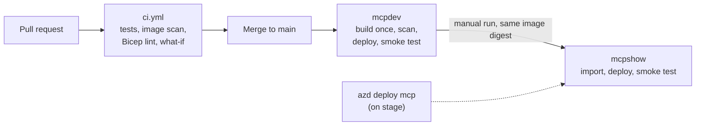

GitHub signs in to Azure with OIDC: no stored secrets.

## See every call

You must be able to answer "who did what, when, with which result" without leaking data into logs. Every
tool call writes one JSON line, argument **names** only, never values, and Log Analytics makes it queryable:

```json
{"event": "tool_call", "tool": "apply_discount", "arg_names": ["amount", "reason", "stock_number"],
 "caller_id": "7871a41e-...", "caller_kind": "user", "outcome": "error", "duration_ms": 7.7}
```

```kusto
ContainerAppConsoleLogs_CL
| where ContainerAppName_s == "ca-mcp-mcpshow" and Log_s has "\"event\": \"tool_call\""
| extend e = parse_json(substring(Log_s, indexof(Log_s, "{")))
| project TimeGenerated, tool = tostring(e.tool), outcome = tostring(e.outcome), ms = todouble(e.duration_ms)
```

## From one server to hundreds

One good server is the start. At company scale the same controls move into a shared gateway and registry,
so hundreds of teams don't each rebuild them.

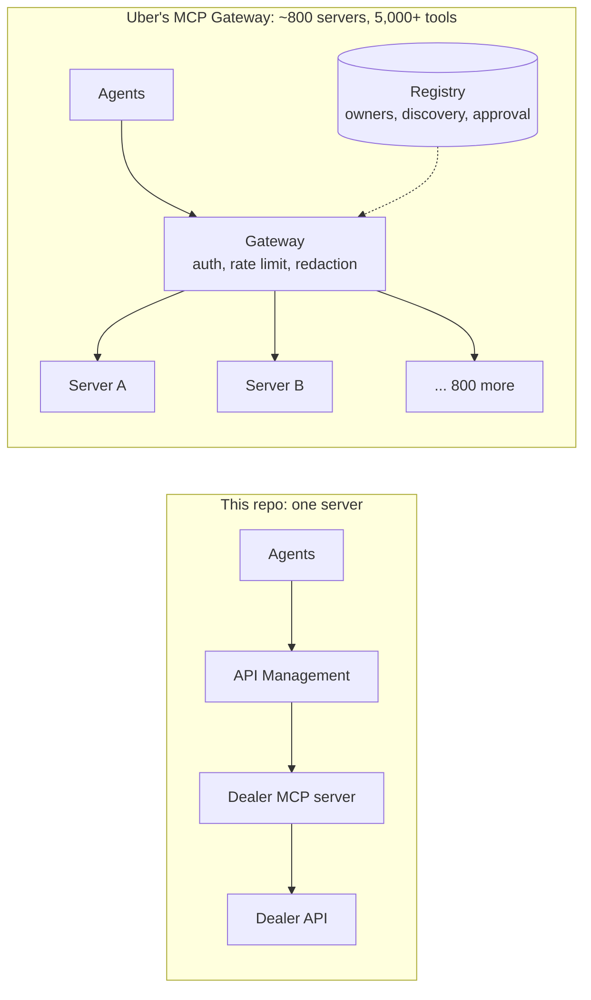

Same controls, moved to a shared place. Source: [Designing Uber's MCP Gateway](https://www.uber.com/us/en/blog/designing-mcp-gateway/).
Comparison and enterprise questions: [deep dive §7 and §9](docs/DEEP-DIVE.md#from-one-server-to-hundreds).

---

## Run it

### Locally (about 2 minutes, no Azure)

With the helper scripts:

```bash
./scripts/demo.sh setup                    # dependencies, .env, local signing keys
./scripts/demo.sh dms                      # terminal 1: mock dealer system on :8081
./scripts/demo.sh live                     # terminal 2: the stage-built server on :8080/mcp, reloads on save
./scripts/demo.sh inspector salesperson    # terminal 3: MCP Inspector with a local token
```

Prefer clicking to typing? Open [`workshop/demo.ipynb`](workshop/demo.ipynb) in VS Code and run the cells
in order: it starts the servers, switches stages and makes every call of the session for you, then connects
Copilot to the server you built.

Or by hand, running the full reference build (11 tools):

```bash
uv sync
cp .env.example .env                       # then set DMS_API_KEY to any long random string
set -a; source .env; set +a
uv run dms &                               # mock dealer system on :8081
uv run dev-token salesperson > /dev/null   # creates .dev/ keys on first run
uv run server                              # reference MCP server on :8080/mcp

TOKEN=$(uv run dev-token salesperson)      # or: manager, agent, readonly
npx @modelcontextprotocol/inspector --cli http://127.0.0.1:8080/mcp \
  --transport http --header "Authorization: Bearer $TOKEN" --method tools/list
```

Local tokens are signed by a key in `.dev/` (git-ignored) and only work with `AUTH_MODE=local`.
In Azure the server runs with `AUTH_MODE=entra` and trusts only Microsoft Entra ID.

Other helpers: `./scripts/demo.sh token <persona>` prints a token, `chaos slow|errors|flaky|off`
breaks the dealer system on purpose, `reset` restores the demo data, `stage N` swaps in a stage file.

### Tests

```bash
uv run pytest -q              # 76 tests over real HTTP with real JWTs
uv run ruff check src tests
./scripts/demo.sh rehearse    # 34 runbook steps, end to end
```

| File | Covers |
| --- | --- |
| `test_auth.py` | Token validation, scope and role mapping, hidden tools |
| `test_policy_and_danger.py` | Discount limits, 15% cap, confirmation, prompt-injection resistance |
| `test_resilience_and_safety.py` | Timeouts, retries, circuit breaker, error masking, secret hygiene, rate limit, audit |
| `test_read_tools.py`, `test_write_tools.py` | Search, quotes, validation; leads, idempotency, masking, ownership |
| `test_domain.py` | Pricing, HST, finance, policy, masking |
| `test_tool_contracts.py` | Every tool has one permission tag, annotations and a schema |
| `test_legacy_clients.py` | Confirmation for 2025-11-25 clients |
| `test_hardening.py` | Foreign `Origin` rejected; confirmation across two replicas |
| `test_live_stages.py` | Every workshop stage file |

### Deploy to Azure

Needs [azd](https://aka.ms/azd) 1.35+, the Azure CLI, and rights to create resource groups and app registrations.

Prefer a guided version? Open [`workshop/deploy-azure.ipynb`](workshop/deploy-azure.ipynb): it signs you in, asks for
the subscription, a name and a region, shows what will be created and what it costs, and deploys only after you
type `yes`. Its last cell deletes everything again.

```bash
azd auth login && az login
azd env new mcpdev --location canadacentral
azd up                       # about 45 min (mostly API Management)
azd env get-value MCP_URL    # https://apim-mcpdev-<id>.azure-api.net/mcp
```

| Command | When |
| --- | --- |
| `azd deploy mcp` | Ship new server code only, about 75 s (what happens on stage) |
| `azd provision` | Infrastructure only |
| `azd env set MCP_COMMAND server && azd provision` | Run the full reference build in the cloud instead of the stage build |
| `azd env set ASSIGN_MANAGER_ROLE true && azd provision` | Make yourself a sales manager (confirmation demo in VS Code) |
| `azd env set DEPLOY_FOUNDRY true && azd provision` | Add a Foundry account, project and model |
| `azd down --purge --force` | Delete everything, including the soft-deleted Key Vault |

What you get: a resource group with a VNet, API Management (the public URL), a Container Apps environment
with `ca-mcp` (accepts only the gateway) and `ca-dms` (internal), Premium ACR and Key Vault behind private
endpoints, a managed identity, Log Analytics + Application Insights, and the Entra app registration.

### CI/CD

| Workflow | Runs on | Does |
| --- | --- | --- |
| `ci.yml` | Pull request | ruff + pytest, Docker build + Trivy, Bicep build + lint, `azd provision --preview` what-if on dev |
| `release.yml` | Push to `main`, or manual | Provision if infra changed; build once, scan, deploy dev, smoke test; prod gets the same digest via `az acr import` |

```bash
gh workflow run release.yml -f scope=all -f prod=true    # promote to prod (mcpshow)
```

| Setting | Level | Value |
| --- | --- | --- |
| `AZURE_CLIENT_ID`, `AZURE_TENANT_ID`, `AZURE_SUBSCRIPTION_ID`, `AZURE_LOCATION` | Repo variables | CI identity (OIDC), subscription, region |
| `AZURE_ENV_NAME` | Environment variable (`dev`, `prod`) | `mcpdev`, `mcpshow` |
| `DMS_API_KEY` | Environment secret (`dev`, `prod`) | Service key, written to Key Vault |

Don't run `azd provision` from a laptop on the CI-owned environments: the preprovision hook would
generate a new `DMS_API_KEY` that no longer matches the GitHub secret. `azd deploy mcp` is fine.

### Connect a client

The server is a standard remote MCP endpoint: Streamable HTTP plus OAuth 2.0 bearer tokens from Entra.
A client that calls without a token gets a 401 pointing to the sign-in metadata, so MCP-aware clients
sign in on their own.

**VS Code + GitHub Copilot.** `.vscode/mcp.json` has three servers: `dealer-local` (asks for a local
token), `dealer-cloud` (the show environment, Microsoft sign-in) and `dealer-spare` (the hot spare).
Run *MCP: List Servers* > pick one > *Start*, then use Copilot in Agent mode.

**Claude Code** (bearer token from the Azure CLI, which is pre-authorized on the Entra app):

```bash
API=$(azd env get-value ENTRA_API_URI)
TOKEN=$(az account get-access-token --scope "$API/dms.read" "$API/dms.write" --query accessToken -o tsv)
claude mcp add --transport http dealer-cloud "$(azd env get-value MCP_URL)" \
  --header "Authorization: Bearer $TOKEN"
```

**MCP Inspector:**

```bash
npx @modelcontextprotocol/inspector@latest --web --transport http \
  --server-url "$(azd env get-value MCP_URL)" \
  --header "Authorization: Bearer $TOKEN" --protocol-era modern
```

**Microsoft Foundry agent:** app-only, with the agent's own identity and the `dms.agent.*` roles.
See [docs/foundry-agent.md](docs/foundry-agent.md).

### Layout

```
src/dms/        mock dealer system (FastAPI, API key, chaos switch)
src/server/     MCP server, reference build (11 tools)
src/live/       the file built on stage (equals workshop/stages/stage_5.py on main)
tests/          76 tests over real HTTP with real JWTs
infra/          main.bicep + modules: network, apim, apim-api, platform, entra, foundry
workshop/       demo.ipynb, azure.ipynb, deploy-azure.ipynb, stage files 0-5, paste snippets, rehearsal script
scripts/        demo.sh, preshow.sh, smoke.sh, CI and azd hooks
.github/        ci.yml (PR checks + what-if), release.yml (dev, then prod)
docs/           deep dive, runbook, show prep, HLD, checklist, slide deck, architecture.svg (+ .png)
```

---

## Deep dive

The full reference, with every practice, where the repo implements it, and the official source:
**[docs/DEEP-DIVE.md](docs/DEEP-DIVE.md)**. MCP basics and the 2026-07-28 changes · architecture
components · all 11 tools · security controls with tests · development · operations · scalability ·
observability · enterprise questions answered · AI engineering lessons.

Presenting this workshop yourself? Present the theory from slides, run [`workshop/demo.ipynb`](workshop/demo.ipynb) and
[`workshop/azure.ipynb`](workshop/azure.ipynb) for the hands-on part, and keep [docs/RUNBOOK.md](docs/RUNBOOK.md) for timing and fallbacks.
