[](https://github.com/hkaanturgut/zero-to-production-mcp/actions/workflows/release.yml)

# Zero to Production MCP: turn any API into an agent tool

Workshop companion for **"From Zero to Production MCP Server: Turn Any API Into an Agent Tool"**
(MCP Dev Summit Toronto, 5 Oct 2026).

A remote MCP server that lets a salesperson's agent search inventory, quote all-in prices,
estimate payments and book test drives at a **fictional** Toronto used-car dealer. The
scenario is only the showcase. The point is the patterns: authentication, least privilege,
human confirmation, secrets the model never sees, failure handling, observability, and a
Bicep + azd path to Azure, with GitHub Actions for CI/CD.

All cars, customers and leads are synthetic.

**Contents**

1. [MCP in five minutes](#1-mcp-in-five-minutes)
2. [Architecture](#2-architecture)
3. [The tools](#3-the-tools)
4. [Security](#4-security)
5. [Development](#5-development)
6. [Operations and maintenance](#6-operations-and-maintenance)
7. [Scalability and reliability](#7-scalability-and-reliability)
8. [Observability and traceability](#8-observability-and-traceability)
9. [Known gaps and hardening backlog](#9-known-gaps-and-hardening-backlog)
10. [Enterprise questions, answered](#10-enterprise-questions-answered)
11. [AI engineering lessons](#11-ai-engineering-lessons)
12. [Quick start](#12-quick-start-offline-about-2-minutes) · [Tests](#13-run-the-tests) · [Deploy](#14-deploy-to-azure-bicep--azd) · [CI/CD](#15-cicd) · [Connect a client](#16-connect-a-client) · [Layout](#17-layout)

---

## 1. MCP in five minutes

The [Model Context Protocol](https://modelcontextprotocol.io/specification/2026-07-28) is an
open standard for connecting AI applications to tools and data. It uses JSON-RPC 2.0 and
three roles ([architecture](https://modelcontextprotocol.io/specification/2026-07-28/architecture)):

| Role | What it is | Here |
| --- | --- | --- |
| **Host** | The AI application the user talks to | VS Code + GitHub Copilot, Claude Code, a Foundry agent |
| **Client** | A connector inside the host, one per server | Built into each host |
| **Server** | A program that exposes capabilities | This repo: `src/server` (reference) and `src/live/server.py` (built on stage) |

A server can offer three kinds of capability:

- **Tools**: functions the model can call (`search_inventory`, `apply_discount`). This server uses tools only.
- **Resources**: data the host can read, such as files or records.
- **Prompts**: reusable prompt templates the user picks.

**Why MCP instead of a plain REST API?** Write the integration once and every MCP host can use
it. The model discovers tools, their input and output schemas, and their descriptions at
runtime. Auth, consent and confirmation are part of the protocol, not left to each app.

### What changed in spec 2026-07-28

This server targets the [2026-07-28 revision](https://modelcontextprotocol.io/specification/2026-07-28/changelog),
the current version per the [versioning page](https://modelcontextprotocol.io/specification/versioning).

| Change | What it means | Where it shows up here |
| --- | --- | --- |
| **Stateless** | No `initialize` handshake and no sessions. The protocol version travels on every request (`MCP-Protocol-Version` header). | Any replica can answer any request; no sticky sessions. |
| **Multi round-trip requests (MRTR)** | A tool can return `InputRequiredResult`; the client asks the user and retries the same call with the answer and an opaque `requestState`. | Manager discounts and deletes (`confirmation()` in `src/server/tools/common.py`). |
| **Client ID Metadata Documents (CIMD)** | Clients identify themselves with a URL to a metadata document. [Dynamic Client Registration is deprecated](https://modelcontextprotocol.io/specification/2026-07-28/basic/authorization/client-registration) in favour of CIMD; pre-registered clients still come first. | We pre-authorize known clients (VS Code, Azure CLI) in Entra. |
| **Deprecated: Roots, Sampling, Logging** | See the [deprecation registry](https://modelcontextprotocol.io/specification/2026-07-28/deprecated). `logging/setLevel` is removed. | Not used. Logs go to stdout and Log Analytics instead. |

The server still serves 2025-11-25 ("handshake-era") clients: `confirmation()` falls back to
classic `ctx.elicit`. `tests/test_legacy_clients.py` covers both eras.

---

## 2. Architecture



One request, end to end:

1. **Discover.** A call without a token gets 401 with `resource_metadata`, pointing to the
   [Protected Resource Metadata](https://www.rfc-editor.org/rfc/rfc9728.html), which names Entra and the scopes.
2. **Sign in.** The client gets a v2 token from Entra: delegated scopes for people, app roles for agents.
3. **Call.** `POST /mcp` with the bearer token. Stateless, so any replica can answer.
4. **Verify.** Signature, issuer and audience are checked; `scp` and `roles` merge into one permission set, and tools the caller can't use are hidden.
5. **Act.** Business rules run in code, then the server calls the internal DMS with its API key. The caller's token never goes downstream.
6. **Secret.** `DMS_API_KEY` is a Key Vault reference resolved by a user-assigned managed identity.
7. **Audit.** One JSON line per tool call (correlation ID, tool, argument names, caller) lands in Log Analytics.

| Component | Azure resource | Notes |
| --- | --- | --- |
| MCP server | Container App `ca-mcp-<env>` | Public HTTPS, `/mcp` and `/healthz`, 1 to 3 replicas |
| Dealer API (mock DMS) | Container App `ca-dms-<env>` | Internal ingress only (404 from the internet), exactly 1 replica (in-memory data) |
| Image | Azure Container Registry | One image, two entry points (`APP_ENTRY`); admin user off, pull by managed identity; base image mirrored in |
| Secret | Azure Key Vault (RBAC mode) | `DMS_API_KEY`, read through a Container Apps Key Vault reference |
| Identity | User-assigned managed identity | Key Vault Secrets User, AcrPull |
| Telemetry | Log Analytics + Application Insights | Console logs and audit lines; optional OpenTelemetry |
| Sign-in | Microsoft Entra app `dealer-mcp-<env>` | 2 scopes, 3 app roles, VS Code and Azure CLI pre-authorized |

Design notes: [docs/HLD.md](docs/HLD.md). Stage runbook: [docs/RUNBOOK.md](docs/RUNBOOK.md). Show prep and fallbacks: [docs/SHOW-PREP.md](docs/SHOW-PREP.md).

---

## 3. The tools

The reference build (`src/server`) has 11 tools. The stage build (`src/live/server.py`) grows to
7 of them over the workshop. Every tool has exactly one permission tag; a caller sees only the
tools their permissions allow.

| Tool | Tag → permission | Annotations | Inputs (validated) | Returns | Confirmation | Stage build |
| --- | --- | --- | --- | --- | --- | --- |
| `search_inventory` | read → `dms.read` | read-only, idempotent | make, model, body_type, drivetrain, max_price (1k to 200k), max_km, min_year, page (1 to 20) | `SearchResult`, 10 per page, cheapest first | no | yes |
| `get_vehicle` | read | read-only, idempotent | stock_number (`TBA-` + 4 digits) | `VehicleDetail` | no | yes |
| `quote_price` | read | read-only, idempotent | stock_number | `Quote`: price, every fee, discount, HST | no | yes |
| `estimate_payment` | read | read-only, idempotent | stock_number, term 36 to 84 months, down payment | `PaymentEstimate` | no | |
| `check_test_drive_slots` | read | read-only, idempotent | day (today to +30, not Sunday) | `Slots` | no | |
| `create_lead` | write → `dms.write` | idempotent | first/last name, phone pattern, email, stock_number, note (500 max) | `LeadSummary`, masked | no | yes |
| `get_lead` | write | read-only, idempotent | lead_id (`L-` + 16 hex) | `LeadSummary`, masked; note marked untrusted | no | yes |
| `book_test_drive` | write | idempotent | lead_id, stock_number, slot | `Booking` | no | |
| `apply_discount` | write | destructive | stock_number, amount (>0, max 50k), reason (3 to 200 chars) | `DiscountResult` | above $500 (manager only) | yes |
| `mark_vehicle_sold` | manager → `dms.manager` | destructive | stock_number | `SoldResult` | always | |
| `delete_lead` | manager | destructive | lead_id | `DeleteResult` (soft delete) | always | yes |

| Persona | Token | Sees |
| --- | --- | --- |
| `readonly` | user, `dms.read` | 5 read tools |
| `salesperson` | user, `dms.read dms.write` | 9 tools, discounts up to $500 |
| `agent` | app-only, roles `dms.agent.read dms.agent.write` (like a Foundry agent) | 9 tools, never manager |
| `manager` | user, adds the `dms.manager` role | 11 tools, larger discounts after confirmation |

Design choices worth noticing:

- `get_lead` is read-only but tagged **write**: reading customer PII needs the stronger permission.
- **Annotations are hints, not security.** The [tools spec](https://modelcontextprotocol.io/specification/2026-07-28/server/tools)
  says clients must treat them as untrusted. Enforcement lives in the server (`AuthMiddleware`).
- **Pagination instead of truncation.** Responses are bounded by design, so output schemas stay intact.

---

## 4. Security

Each row is a practice, where this repo implements it, and the official source behind it.

| Practice | How it's done here | Source |
| --- | --- | --- |
| **Validate every token**: signature, issuer, audience, expiry | `EntraVerifier` (FastMCP `JWTVerifier`): v2 issuer `.../v2.0`, `aud` = the app's client ID | [MCP authorization](https://modelcontextprotocol.io/specification/2026-07-28/basic/authorization), [Entra access token claims](https://learn.microsoft.com/en-us/entra/identity-platform/access-token-claims-reference) |
| **Advertise how to sign in** | Protected Resource Metadata at `/.well-known/oauth-protected-resource/mcp`; 401s carry `resource_metadata` | [RFC 9728](https://www.rfc-editor.org/rfc/rfc9728.html) |
| **No token passthrough** | The caller's token is never sent to the DMS. The server uses its own API key and forwards only the caller's object ID. | [Security best practices](https://modelcontextprotocol.io/docs/2026-07-28/tutorials/security/security_best_practices) |
| **Audience-bound tokens** | Scopes live on the identifier URI `api://<tenant>/dealer-mcp-<env>`; tokens for other resources are rejected | [RFC 8707](https://www.rfc-editor.org/rfc/rfc8707.html), [Expose a web API](https://learn.microsoft.com/en-us/entra/identity-platform/quickstart-configure-app-expose-web-apis) |
| **People and agents are different principals** | Delegated scopes (`scp`) for people, app roles (`roles`) for agents, merged through a `ROLES` map. Role values differ from scope values so they can't be confused. | [Add app roles](https://learn.microsoft.com/en-us/entra/identity-platform/howto-add-app-roles-in-apps) |
| **Least privilege per tool** | One tag per tool, enforced by `AuthMiddleware` + `restrict_tag`; hidden from `tools/list` when not allowed; checked in CI by `test_tool_contracts.py` | [OWASP LLM06 Excessive Agency](https://genai.owasp.org/llmrisk/llm062025-excessive-agency/) |
| **No manager rights for agents** | `dms.manager` is a User-only role; applications can't hold it | Same |
| **Policy in code, not prompts** | 15% hard cap, $500 limit, manager above that, Decimal math (`domain/policy.py`, `domain/pricing.py`) | [OWASP LLM01 Prompt Injection](https://genai.owasp.org/llmrisk/llm01-prompt-injection/) |
| **Untrusted text is data** | Lead notes are labelled untrusted. Lead `L-760debbb3b70b3a1` contains an injected instruction; the model may read it, but policy still refuses. | Same |
| **Human in the loop** | Destructive or costly actions return `InputRequiredResult`; the answer is checked against the original arguments | [MRTR](https://modelcontextprotocol.io/specification/2026-07-28/basic/patterns/mrtr), [Elicitation](https://modelcontextprotocol.io/specification/2026-07-28/client/elicitation) |
| **Tamper-proof confirmation state** | The MCP SDK seals `requestState` (AES-256-GCM) and binds it to the caller and request; `confirmation()` also rejects changed arguments | [MRTR](https://modelcontextprotocol.io/specification/2026-07-28/basic/patterns/mrtr) (requestState is attacker-controlled) |
| **Secrets the model never sees** | `DMS_API_KEY` only in Key Vault, read by managed identity; never in arguments, results, errors or logs (`test_backend_secret_never_reaches_the_client`) | [Container Apps secrets](https://learn.microsoft.com/en-us/azure/container-apps/manage-secrets), [Key Vault RBAC](https://learn.microsoft.com/en-us/azure/key-vault/general/rbac-guide) |
| **Minimal data out** | Phone shows last 4 digits, email first letter + domain, names shortened (`domain/masking.py`) | [Security best practices](https://modelcontextprotocol.io/docs/2026-07-28/tutorials/security/security_best_practices) (scope minimization) |
| **Bind data to the caller** | Lead IDs are random; a salesperson can't read another salesperson's lead (`test_cannot_read_another_salespersons_lead`) | Same (state handle hijacking) |
| **Private backend** | DMS has internal ingress only | [Container Apps ingress](https://learn.microsoft.com/en-us/azure/container-apps/ingress-overview) |
| **No secrets in CI** | GitHub OIDC federation; CI identity has Contributor, RBAC Admin limited to two roles, Graph rights only on apps it owns | [GitHub OIDC to Azure](https://learn.microsoft.com/en-us/azure/developer/github/connect-from-azure-openid-connect), [Workload identity federation](https://learn.microsoft.com/en-us/entra/workload-id/workload-identity-federation-create-trust) |
| **Supply chain** | Actions pinned (Trivy by commit SHA), packages locked (`uv.lock`), image scanned, HIGH/CRITICAL fail the release | [GitHub OIDC reference](https://docs.github.com/en/actions/reference/security/oidc) |

Security tests to read first: `tests/test_auth.py`, `tests/test_policy_and_danger.py`,
`tests/test_resilience_and_safety.py`. The full checklist is in [docs/CHECKLIST.md](docs/CHECKLIST.md).

---

## 5. Development

**Tool design**

- Verb-first names, one job each. Descriptions say what *not* to do ("Never add fees or tax yourself").
- Typed, bounded inputs (Pydantic `Field` limits and patterns). The model gets a schema error before your backend sees bad input.
- Output schemas (`Vehicle`, `SearchResult`, `Quote`) so hosts get `structuredContent`, not prose to parse.
- Expected failures return `isError` results the model can act on ("Discounts over $500 need a sales manager."); protocol errors are for protocol problems. See the [tools spec](https://modelcontextprotocol.io/specification/2026-07-28/server/tools).
- Business math in code with `Decimal`, never in the model.

**Two FastMCP middlewares we deliberately don't use**

- `ErrorHandlingMiddleware`: it turns tool errors into protocol errors, so the model can't recover.
- `ResponseLimitingMiddleware`: truncation strips output schemas. Bound responses by design instead (pagination).

**Testing**

- 76 tests over real HTTP with real JWTs (`tests/conftest.py` starts the DMS and the server).
- Read tool results through `.structured_content` (`.data` returns objects).
- `tests/test_live_stages.py` runs every workshop stage, so the live build can't drift.
- `./scripts/demo.sh rehearse` runs the 34-step stage runbook end to end.
- [MCP Inspector](https://modelcontextprotocol.io/docs/tools/inspector) for manual checks. Pass `--protocol-era modern`; the default is legacy.

**Swappable backend.** Tools depend on the `DmsBackend` protocol (`src/server/backend/base.py`), not
on the mock. Swap in a real DMS client without touching tool code.

---

## 6. Operations and maintenance

| Topic | Practice here |
| --- | --- |
| **Build once, promote** | One image per commit, scanned once, promoted dev → prod with `az acr import` of the same digest. What you tested is what runs. |
| **Infra as code** | Bicep at subscription scope, deployed by azd. PRs show an `azd provision --preview` what-if. |
| **Environments** | `mcpdev` (every push to main), `mcpshow` (manual run with `prod=true`), `mcprehearse` (hot spare, hand-deployed). |
| **Pinning** | FastMCP `4.0.10`, locked dependencies, actions pinned; base image mirrored into ACR so builds don't depend on Docker Hub. |
| **Scanning** | Trivy on every PR and release; fix by patching, not by disabling the scan (see the Dockerfile's OS upgrade step). |
| **Rollback** | Apps run in single-revision mode. Roll back by deploying the previous image tag (re-run the release on the earlier commit, or `az containerapp update --image`). |
| **Secret rotation** | Rotate `DMS_API_KEY` in the GitHub environment secret and re-provision through CI. Never `azd provision` from a laptop on CI-owned envs (it would generate a new key). |
| **Protocol upgrades** | The spec is versioned by date. Support the new era first, keep a fallback for the old one (as `confirmation()` does), and test both. |
| **Deprecations** | Track the [deprecation registry](https://modelcontextprotocol.io/specification/2026-07-28/deprecated) and avoid deprecated features in new code. |

---

## 7. Scalability and reliability

| Concern | Setting | Why |
| --- | --- | --- |
| **Stateless server** | No sessions (2026-07-28) | Horizontal scale without sticky routing |
| **Replicas** | MCP app 1 to 3, DMS exactly 1 | Min 1 avoids cold starts on stage ([scaling](https://learn.microsoft.com/en-us/azure/container-apps/scale-app)); the mock DMS keeps data in memory |
| **Per-attempt deadline** | `asyncio.timeout(1.5)` around each backend call | httpx timeouts apply per phase, so a slow body can exceed them; this caps the whole attempt |
| **Retries** | Reads: 3 attempts, backoff `0.2 · 2^n` s plus jitter. Writes: 1 attempt. | A blind write retry can double a discount |
| **Idempotency** | Writes carry `Idempotency-Key` = hash(caller, tool, arguments) | An agent retry is safe |
| **Circuit breaker** | Opens after 5 failures, half-open after 30 s | Fail fast instead of piling up on a sick backend |
| **Rate limit** | 5 requests/s per caller, burst 20 (keyed by token subject, not IP) | One runaway agent can't starve the rest |
| **Health** | `/healthz` probes | Container Apps restarts unhealthy replicas |

Try it live: `./scripts/demo.sh chaos slow|errors|flaky|off` breaks the DMS on purpose.

---

## 8. Observability and traceability

Every tool call writes one JSON audit line:

```json
{"event": "tool_call", "correlation_id": "465ac6a3...", "tool": "apply_discount",
 "arg_names": ["amount", "reason", "stock_number"], "caller_id": "7871a41e-...",
 "caller_kind": "user", "permissions": ["dms.read", "dms.write"],
 "outcome": "error", "error_type": "ToolError", "duration_ms": 7.7}
```

- **Argument names, never values**: no PII or secrets in logs, but you can still tell what was attempted.
- **`caller_id`** is the Entra object ID (`oid`), so you can trace a call to a person or an agent identity.
- **`outcome`**: `ok`, `input_required` (waiting for confirmation), `tool_error` (an `isError` result), `denied` (authorization) or `error` (an exception, including policy refusals; `error_type` says which).

Container Apps ships stdout/stderr to Log Analytics ([log monitoring](https://learn.microsoft.com/en-us/azure/container-apps/log-monitoring)).
This query runs against the real workspace:

```kusto
ContainerAppConsoleLogs_CL
| where ContainerAppName_s == "ca-mcp-mcpshow" and Log_s has "\"event\": \"tool_call\""
| extend e = parse_json(substring(Log_s, indexof(Log_s, "{")))
| project TimeGenerated, tool = tostring(e.tool), outcome = tostring(e.outcome),
          caller = tostring(e.caller_kind), ms = todouble(e.duration_ms), cid = tostring(e.correlation_id)
| order by TimeGenerated desc
```

Live tail from a terminal:

```bash
az containerapp logs show -g rg-mcpshow -n ca-mcp-mcpshow --follow --format text | grep tool_call
```

Set `APPLICATIONINSIGHTS_CONNECTION_STRING` to add OpenTelemetry traces through
[azure-monitor-opentelemetry](https://learn.microsoft.com/en-us/azure/azure-monitor/app/opentelemetry-enable).

---

## 9. Known gaps and hardening backlog

Being honest about these is part of production readiness. None of them affects the workshop
demo, which runs on a single replica. The stage build (`src/live`) stays as taught; the fixes live
in the reference build (`src/server`), which you switch to with `MCP_COMMAND=server`.

| Gap | Risk | Fix |
| --- | --- | --- |
| **Fixed in the reference build.** `requestState` was sealed with a per-process key (SDK default) | With more than one replica, a confirmation answered on a different replica fails closed (`Invalid or expired requestState`) | Set `REQUEST_STATE_KEYS` (comma-separated ring, first key seals; rotate as `new,old` then `new`). Store it in Key Vault like `DMS_API_KEY`. Tested in `test_hardening.py` with two replicas. |
| Rate limit is in memory, per replica | With 3 replicas a caller gets up to 3× the limit | Enforce at a gateway ([API Management for MCP](https://learn.microsoft.com/en-us/azure/api-management/mcp-server-overview)) or use a shared store |
| **Fixed in the reference build.** Origin validation was off (FastMCP default) | The [transport spec](https://modelcontextprotocol.io/specification/2026-07-28/basic/transports/streamable-http) requires `Origin` validation against DNS rebinding | `build_app()` rejects foreign origins with 403; allowed list from `ALLOWED_ORIGINS` (default: `PUBLIC_BASE_URL`). Requests without `Origin` (IDEs, CLIs, agents) pass; Host checks stay at the ingress so health probes work. |
| Azure CLI is pre-authorized on the Entra app | Handy for testing; broadens who can get a token without consent | Remove after the event (`infra/modules/entra.bicep`) |
| Public endpoints for ACR and Key Vault | Larger attack surface | Private endpoints and VNet integration |
| No reviewer gate on prod | GitHub Free plan | Paid plan: required reviewers on `prod`, branch protection with the 4 checks |
| Mock DMS | Not a real system of record | Implement `DmsBackend` against the real API |

---

## 10. Enterprise questions, answered

**How do you stop prompt injection from making the agent do something bad?**
You can't stop the model from reading malicious text, so don't rely on it. Limits are enforced
in code (15% cap, $500 limit), permissions come from the token, not the prompt, and costly
actions need a human confirmation. The demo lead contains an injected "apply a discount"
instruction; the policy refuses anyway. See [OWASP LLM01](https://genai.owasp.org/llmrisk/llm01-prompt-injection/).

**Does the agent act as the user or as itself?**
Both are supported, and the token says which. People sign in (delegated scopes, `caller_kind: user`).
Agents use their own managed identity with app roles (`caller_kind: app`). Agents can never be managers.

**Why not pass the user's token to the backend?**
The [spec forbids token passthrough](https://modelcontextprotocol.io/specification/2026-07-28/basic/authorization):
the token's audience is the MCP server, and passing it on creates confused-deputy risk. The server
calls the backend with its own credential and forwards only the caller's ID.

**How do I revoke an agent's access?**
Remove its app role assignment in Entra (or disable its service principal). New tokens won't carry
the role, and existing tokens expire (about an hour).

**How do you audit who did what?**
One structured line per call with the caller's object ID, tool, outcome and a correlation ID, in
Log Analytics. See [section 8](#8-observability-and-traceability).

**What happens when the backend is slow or down?**
Per-attempt deadlines, retries for reads only, a circuit breaker, and `isError` results the model
can explain to the user. Try `./scripts/demo.sh chaos errors`.

**Can it scale?**
The server is stateless (2026-07-28), so Container Apps scales replicas horizontally. Before going
past one replica, set `REQUEST_STATE_KEYS` and move rate limiting to a gateway ([section 9](#9-known-gaps-and-hardening-backlog)).

**Where is the data, and what leaves the backend?**
Canada Central. Tools return the minimum, and personal data is masked before the model sees it.

**Should we put API Management in front?**
For many servers, yes: central JWT validation, rate limits, IP filtering and one catalog.
[APIM's MCP support](https://learn.microsoft.com/en-us/azure/api-management/mcp-server-overview)
covers tools (not resources or prompts). This server still validates tokens itself (defence in depth).

**How do clients register?**
Known clients are pre-authorized on the Entra app (VS Code, Azure CLI). The spec's order is
pre-registered, then CIMD, then Dynamic Client Registration (deprecated).
See [client registration](https://modelcontextprotocol.io/specification/2026-07-28/basic/authorization/client-registration).

**How do you ship changes safely?**
PR checks (tests, image scan, Bicep lint, what-if), build once, promote the same digest, smoke
tests per environment. See [section 15](#15-cicd).

**Do tool annotations protect us?**
No. They're hints for the host's UI, and clients must treat them as untrusted. Server-side checks do the protecting.

---

## 11. AI engineering lessons

- **The model is a user, not a component.** Treat every tool call like an untrusted request from the internet.
- **Put rules where the model can't reach them.** Policy, math and permissions belong in code.
- **Design tools for the model.** Clear names, narrow jobs, schemas and descriptions that say what not to do. A good tool description is a prompt.
- **Errors are UX.** An `isError` result with a clear sentence lets the model recover and explain; a stack trace doesn't.
- **Identity is the hard part.** Getting `aud`, `iss`, scopes vs roles and pre-authorization right took more effort than any tool.
- **Test the protocol, not just the functions.** Real HTTP, real JWTs, both protocol eras, and a rehearsal script that runs the demo.
- **Production is mostly boring things done consistently:** timeouts, retries, idempotency, audit, scanning, pinning, and promoting the exact artifact you tested.

---

## 12. Quick start (offline, about 2 minutes)

Requires [uv](https://docs.astral.sh/uv/) and Python 3.11+.

```bash
uv sync
cp .env.example .env                      # then set DMS_API_KEY to any long random string
set -a; source .env; set +a

uv run dms &                              # mock dealer system on :8081
uv run dev-token salesperson > /dev/null  # creates .dev/ keys on first run
uv run server                             # MCP server on :8080/mcp
```

Get a token for a persona and call the server with MCP Inspector:

```bash
TOKEN=$(uv run dev-token salesperson)     # or: manager, agent, readonly
npx @modelcontextprotocol/inspector --cli http://127.0.0.1:8080/mcp \
  --transport http --header "Authorization: Bearer $TOKEN" --method tools/list
```

Local tokens are signed by a key in `.dev/` (git-ignored) and only work with `AUTH_MODE=local`.
In Azure the server runs with `AUTH_MODE=entra` and trusts only Microsoft Entra ID.

## 13. Run the tests

```bash
uv run pytest -q          # 76 tests: auth, policy, confirmation, resilience, secrets, hardening, every live stage
uv run ruff check src tests
./scripts/demo.sh rehearse  # 34 runbook steps
```

| File | Covers |
| --- | --- |
| `test_auth.py` | Token validation, scope and role mapping, hidden tools |
| `test_domain.py` | Pricing, HST, finance, policy, masking |
| `test_policy_and_danger.py` | Discount limits, 15% cap, confirmation, prompt-injection resistance |
| `test_legacy_clients.py` | Confirmation for 2025-11-25 clients |
| `test_read_tools.py` | Search, pagination, input validation, quotes |
| `test_write_tools.py` | Leads, idempotency, masking, ownership |
| `test_resilience_and_safety.py` | Timeouts, retries, circuit breaker, error masking, secret hygiene, rate limit, audit |
| `test_tool_contracts.py` | Every tool has one tag, annotations and a schema |
| `test_live_stages.py` | Every workshop stage file |
| `test_hardening.py` | Foreign `Origin` rejected; confirmation across two replicas with and without a shared key |

## 14. Deploy to Azure (Bicep + azd)

Requires [azd](https://aka.ms/azd) (1.35 or later) and the Azure CLI. Your account needs rights
to create resource groups and app registrations.

```bash
azd auth login && az login
azd env new mcpdev --location canadacentral
azd up                       # provision (about 6 to 8 min) + build in ACR + deploy
azd env get-value MCP_URL    # https://ca-mcp-mcpdev.<region>.azurecontainerapps.io/mcp
```

| Command | When |
| --- | --- |
| `azd provision` | Infra only (run before the talk) |
| `azd deploy mcp` | Ship new server code only, about 80 s (on stage) |
| `azd env set MCP_COMMAND server && azd provision` | Switch the cloud app to the full reference build |
| `azd env set ASSIGN_MANAGER_ROLE true && azd provision` | Make yourself a sales manager (confirmation demo in VS Code) |
| `azd env set DEPLOY_FOUNDRY true && azd provision` | Add a Foundry account, project and model |
| `azd down --purge --force` | Delete everything, including the soft-deleted Key Vault |

## 15. CI/CD

Two GitHub Actions workflows (details in [docs/HLD.md](docs/HLD.md#cicd)):

- `ci.yml` on pull requests: ruff + pytest, Docker build + Trivy scan, Bicep build + lint,
  and an `azd provision --preview` what-if on dev, posted to the job summary.
- `release.yml` on push to `main` or manual run: provisions only when infra changed, builds
  the image once, scans it, deploys to dev, smoke-tests, then promotes the same tag and
  digest to prod with `az acr import` (no rebuild).

Prod runs on push only if the repo variable `PROD_ON_PUSH` is `true`. Otherwise trigger it:

```bash
gh workflow run release.yml -f scope=all -f prod=true
```

| Setting | Level | Value |
| --- | --- | --- |
| `AZURE_CLIENT_ID`, `AZURE_TENANT_ID`, `AZURE_SUBSCRIPTION_ID`, `AZURE_LOCATION` | Repo variables | CI app registration (OIDC), target subscription and region |
| `AZURE_ENV_NAME` | Environment variable (`dev`, `prod`) | azd env name: `mcpdev`, `mcpshow` |
| `DMS_API_KEY` | Environment secret (`dev`, `prod`) | Service key, written to Key Vault |

Don't run `azd provision` locally on these two envs: the preprovision hook would rotate
`DMS_API_KEY` away from the GitHub secret.

## 16. Connect a client

The server is a standard remote MCP endpoint: Streamable HTTP plus OAuth 2.0 bearer tokens from Entra.

**VS Code + GitHub Copilot.** `.vscode/mcp.json` already has `dealer-cloud`. Run *MCP: List Servers >
dealer-cloud > Start*, sign in with Microsoft, then use Copilot in Agent mode.
See [VS Code MCP servers](https://code.visualstudio.com/docs/copilot/customization/mcp-servers).

**Claude Code.**

```bash
API=$(azd env get-value ENTRA_API_URI)
TOKEN=$(az account get-access-token --scope "$API/dms.read" "$API/dms.write" --query accessToken -o tsv)
claude mcp add --transport http dealer-cloud "$(azd env get-value MCP_URL)" \
  --header "Authorization: Bearer $TOKEN"
```

**MCP Inspector.**

```bash
npx @modelcontextprotocol/inspector@latest --web --transport http \
  --server-url "$(azd env get-value MCP_URL)" \
  --header "Authorization: Bearer $TOKEN" --protocol-era modern
```

**Microsoft Foundry agent.** App-only, with the agent's own identity. See [docs/foundry-agent.md](docs/foundry-agent.md)
and [Foundry MCP tools](https://learn.microsoft.com/en-us/azure/foundry/agents/how-to/tools/model-context-protocol).

## 17. Layout

```
src/dms/        mock dealer system (FastAPI, API key, chaos switch)
src/server/     MCP server, reference build (FastMCP 4, spec 2026-07-28)
src/live/       the file you build on stage (equals workshop/stages/stage_5.py on main)
tests/          pytest suite over real HTTP with real JWTs
infra/          main.bicep + modules (platform, entra, foundry), azd parameters
workshop/       stage files 0-5, paste snippets, rehearsal script
.github/        ci.yml (PR checks + what-if), release.yml (main: dev, then prod)
docs/           HLD, stage runbook, architecture diagram, Foundry agent setup, production checklist
```
