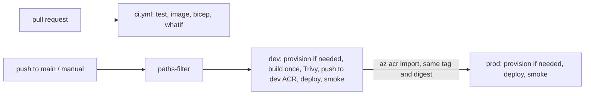

# High-level design

The living HLD (diagrams, threat model, decisions) is maintained as a Claude doc:
"HLD: Production MCP Server (Dealer Sales Assistant)". This file is the pointer
so the repo stays the single place engineers start from. The sections below record
the facts engineers most often need without opening the doc.

## Identity and permissions

One Entra app registration per environment (`infra/modules/entra.bicep`), identifier URI
`api://<tenant>/dealer-mcp-<env>`.

| Kind | Value | Who |
| --- | --- | --- |
| Delegated scope | `dms.read`, `dms.write` | Signed-in salespeople (VS Code is pre-authorized) |
| App role (Application) | `dms.agent.read`, `dms.agent.write` | Foundry agent identities, never manager |
| App role (User) | `dms.manager` | Sales managers only. A role, not a scope, so nobody can consent into it |

Clients request full scope strings, e.g. `api://<tenant>/dealer-mcp-<env>/dms.read`.
Protected Resource Metadata advertises them from `ENTRA_API_URI` (a Bicep output set on
the MCP container app).

Entra requires role values to differ from scope values. The verifier merges `scp` and
`roles` into one permission set through a role map (`ROLES` in `src/live/server.py`,
`ROLE_PERMISSIONS` in `src/server/auth.py`): `dms.agent.read` grants `dms.read`,
`dms.agent.write` grants `dms.write`, `dms.manager` grants `dms.manager`.

## Infrastructure

Bicep at subscription scope (`infra/main.bicep` + modules), driven by azd. azd environment
`mcpdev` backs GitHub environment `dev`, `mcpshow` backs `prod`.

## CI/CD

Two workflows in `.github/workflows/`. Azure sign-in is OIDC only; the one stored secret is
`DMS_API_KEY` per GitHub environment (it lands in Key Vault).

**`ci.yml` (pull requests to main)**

| Job | What it does |
| --- | --- |
| `test` | `ruff check` + `ruff format --check`, then `pytest` |
| `image` | `docker build` (not pushed) + Trivy scan, HIGH/CRITICAL fail |
| `bicep` | `az bicep build` + `az bicep lint` on `infra/main.bicep` |
| `whatif` | `azd provision --preview` on dev via OIDC, output written to the job summary. Changes nothing |

**`release.yml` (push to main, or manual dispatch)**

Manual inputs: `scope` (`auto` \| `all` \| `infra` \| `app`, default `auto`) and `prod` (bool).
`auto` uses `dorny/paths-filter`: `infra/**`, `azure.yaml`, `scripts/azd-*` mean infra;
`src/**`, `Dockerfile`, `.dockerignore`, `pyproject.toml`, `uv.lock` mean app.

- **dev**: `scripts/ci-azd-env.sh` rebuilds the azd env on the runner (injects `DMS_API_KEY`,
  detects first deploy). `azd provision` if infra changed or first deploy, otherwise
  `azd env refresh`. The image is built once as `dealer-mcp:<sha12>`, scanned by Trivy
  (HIGH/CRITICAL fail), pushed to the dev ACR, and rolled to both container apps (DMS first)
  by `scripts/ci-deploy-image.sh`. After a first deploy it re-provisions to add health probes.
  Ends with `scripts/smoke.sh` (healthz, anonymous 401 with `resource_metadata`, PRM).
- **prod**: same provision logic, then `az acr import` copies the same tag (same digest) from
  the dev ACR. No rebuild. Deploy, re-provision on first deploy, smoke test.

Prod runs on push only when repo variable `PROD_ON_PUSH` is `'true'`. It is unset: the repo
is private on the GitHub Free plan, which has no required-reviewer rule for environments, so
prod ships only from a manual dispatch with `prod` ticked.

**Local path and guardrails**

- `azd deploy mcp -e mcpshow` (remote ACR build) is the on-stage path and intentionally
  bypasses CI.
- Never run `azd provision` locally against CI-owned envs (`mcpdev`, `mcpshow`): the
  preprovision hook would generate a new `DMS_API_KEY` and drift away from the GitHub secret.

**CI identity**

Entra app `github-mcp-dealer-assistant-ci` with an OIDC federated credential per GitHub
environment. Subjects use immutable IDs:
`repo:<owner>@<id>/<repo>@<id>:environment:<env>`.

- Azure: `Contributor` + `Role Based Access Control Administrator`, constrained by a
  condition to assign only `AcrPull` and `Key Vault Secrets User`.
- Microsoft Graph application permissions: `Application.ReadWrite.OwnedBy` and
  `AppRoleAssignment.ReadWrite.All`. CI owns the Entra apps it creates.
